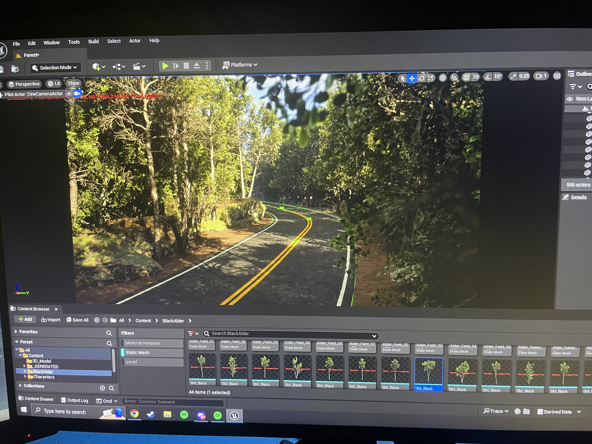
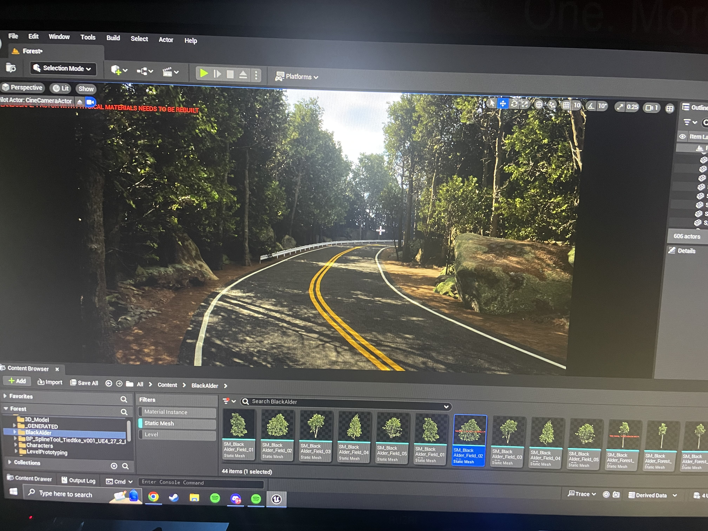

# Forest_UE

## Introduction
This project marks my foray into game development using the Unreal Engine. As a self-taught developer, this is my first venture into Unreal, and I'm excited to share my journey with you. Despite lacking formal teaching, I've embarked on this project with enthusiasm and a willingness to learn.

## About the Project
This project represents the beginning of an exciting adventure into game development. While it's still in its early stages, I'm committed to pushing the boundaries of my skills and creativity to bring this project to life. Expect to see frequent updates and improvements as I progress.

## Project Images

### Beginning of Terrain

This image marks the beginning of the terrain development phase. As you can see, the landscape is just starting to take shape, with basic geometry forming the foundation for the game environment.

### Messing with Spline Tools

Here, I'm experimenting with spline tools to add more life to the scene. By leveraging Unreal Engine's powerful spline functionality, I'm able to create dynamic and organic shapes that enhance the overall aesthetics of the game world.

Thank you for your interest in my Unreal project. Let's embark on this journey together and see where it takes us!

